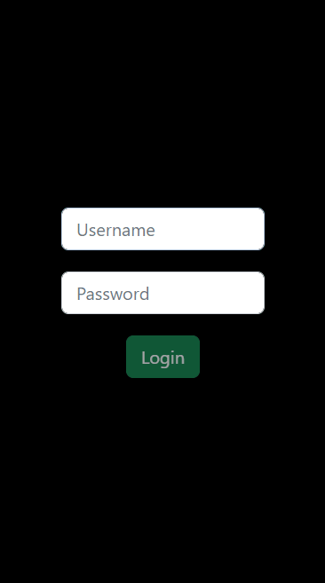

# McHizok

## Long story short
* Really like McDonald's apple pie
* Hungarian restaurants have a promotion to get them for free 🥧
* ...but you have to fill out a survey everytime...too lazy for that
* Happen to be a SW engineer who was looking for a hobby project
* Here we are

    

## Features

* Authentication / Authorization
* Generating one time registration link
* Storing existing coupons for later use
* Downloading coupons

## The project name

The name comes from a word play.
* In hungarian the word "Meghízok" means "I am getting fat"
* Pronouncing the "Mc" from "McDonald's" sounds like "Meg"
* Hence the name "McHizok", because of the applepies 👉👈